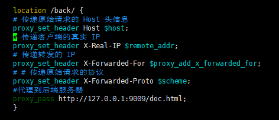

yum install会自动注册systemd

```shell
#安装epel软件库
sudo yum install epel-release -y
#安装Nginx
sudo yum install nginx:latest -y
#启动Nginx
systemctl start nginx
#配置防火墙
sudo firewall-cmd --add-service=http --permanent
sudo firewall-cmd --add-service=https --permanent
sudo firewall-cmd --reload
```

## nginx.cnf

```shell
# For more information on configuration, see:
#   * Official English Documentation: http://nginx.org/en/docs/
#   * Official Russian Documentation: http://nginx.org/ru/docs/

# 指定Nginx运行的用户和组（默认为nginx）。
user nginx;
# 设置工作进程数（auto 表示自动匹配CPU核心数）可以设置具体数量,根据服务器cpu核心数具体设置。
worker_processes auto;
# 定义错误日志路径和级别（warn 表示记录警告及以上级别的日志）。
error_log /var/log/nginx/error.log;
# 指定Nginx主进程的PID文件路径。
pid /run/nginx.pid;

# Load dynamic modules. See /usr/share/doc/nginx/README.dynamic.
include /usr/share/nginx/modules/*.conf;

events {
    # 每个工作进程的最大并发连接数（需结合 worker_processes 计算总并发：worker_processes × worker_connections）。
    worker_connections 1024;
}

http {
    # 日志格式
    log_format  main  '$remote_addr - $remote_user [$time_local] "$request" '
                      '$status $body_bytes_sent "$http_referer" '
                      '"$http_user_agent" "$http_x_forwarded_for"';
    #日常日志位置
    access_log  /var/log/nginx/access.log  main;
    
    # 性能优化
    #用来设置 Nginx 服务器是否使用 sendfifile() 传输文件，该属性可以大大提高Nginx 处理静态资源的性能
    sendfile            on;

    tcp_nopush          on;
    tcp_nodelay         on;
    #用来设置长连接的超时时间
    keepalive_timeout   65;
    types_hash_max_size 4096;

    #包含的http MIME类型
    include             /etc/nginx/mime.types;
    default_type        application/octet-stream;

    # Load modular configuration files from the /etc/nginx/conf.d directory.
    # See http://nginx.org/en/docs/ngx_core_module.html#include
    # for more information.
    include /etc/nginx/conf.d/*.conf;

    server {
        # 监听IPv4的80端口
        listen       80;
        # 监听IPv6的80端口
        listen       [::]:80;
        # 匹配所有域名（默认服务器）
        server_name  _;
        #代表访问ip默认显示页面、网站根目录
       # return 404;
       # root         /dev/null;
        
        # Load configuration files for the default server block.
        include /etc/nginx/default.d/*.conf;
       # proxy_set_header Connection '';
        proxy_http_version 1.1;
       # chunked_transfer_encoding off;
       # proxy_buffering off;
       # proxy_cache off;
      
          
       #swagger通过nginx转发代理
       #^(/v2/|/webjars/|/swagger-resources|/swagger-ui.html|/doc.html)
       location ~* ^(/v2/|/webjars/|/swagger-resources|/swagger-ui.html|/doc.html) {
       # 传递原始请求的 Host 头信息
       proxy_set_header Host $host;
       # 传递客户端的真实 IP
       proxy_set_header X-Real-IP $remote_addr;
       # 传递转发的 IP
       proxy_set_header X-Forwarded-For $proxy_add_x_forwarded_for;
       # # 传递原始请求的协议
       proxy_set_header X-Forwarded-Proto $scheme;
       #代理到后端服务器
       proxy_pass http://127.0.0.1:9009;
       }
       
       location /back/ {
       # 传递原始请求的 Host 头信息
       proxy_set_header Host $host;
       # 传递客户端的真实 IP
       proxy_set_header X-Real-IP $remote_addr;
       # 传递转发的 IP
       proxy_set_header X-Forwarded-For $proxy_add_x_forwarded_for;
       # # 传递原始请求的协议
       proxy_set_header X-Forwarded-Proto $scheme;
       #代理到后端服务器
       proxy_pass http://127.0.0.1:9009;
       }
           
       location / {
       proxy_pass http://127.0.0.1:9009;
       }


       # 配置错误页面 = 表示精准匹配
        error_page 404 /404.html;
        location = /404.html {
        }

        error_page 500 502 503 504 /50x.html;
        location = /50x.html {
        }
    }
    
    server {
        # 监听IPv4的80端口
        listen       80;
        # 监听IPv6的80端口
        listen       [::]:80;
        # 匹配域名为 www.cc.com 
        server_name  www.cc.com;
        #代表访问ip默认显示页面、网站根目录
       # return 404;
       # root         /dev/null;
        
        # Load configuration files for the default server block.
        include /etc/nginx/default.d/*.conf;
       # proxy_set_header Connection '';
        proxy_http_version 1.1;
       # chunked_transfer_encoding off;
       # proxy_buffering off;
       # proxy_cache off;
      

       
       location /back/ {
       # 传递原始请求的 Host 头信息
       proxy_set_header Host $host;
       # 传递客户端的真实 IP
       proxy_set_header X-Real-IP $remote_addr;
       # 传递转发的 IP
       proxy_set_header X-Forwarded-For $proxy_add_x_forwarded_for;
       # # 传递原始请求的协议
       proxy_set_header X-Forwarded-Proto $scheme;
       #代理到后端服务器
       proxy_pass http://127.0.0.1:9009;
       }
           
       location / {
        proxy_pass http://127.0.0.1:9009;
       }

       # 配置错误页面 = 表示精准匹配
        error_page 404 /404.html;
        location = /404.html {
        }

        error_page 500 502 503 504 /50x.html;
        location = /50x.html {
        }
    }

# Settings for a TLS enabled server.
#
    server {
        listen       443 ssl http2;
        listen       [::]:443 ssl http2;
        server_name  www.ccsource.com;
        root         /usr/share/nginx/html;

        # 指定客户端与服务器的连接协议，其中TLSv1 和 TLSv1.1 已被证实存在安全风险
        ssl_protocols  TLSv1.2 TLSv1.3;
        ssl_certificate "/home/key/certificate.crt";
        ssl_certificate_key "/home/key/private.key";
        ssl_session_cache shared:SSL:1m;
        ssl_session_timeout  10m;
        # 指定安全的加密套件
        ssl_ciphers ECDHE-ECDSA-AES256-GCM-SHA384;
        ssl_prefer_server_ciphers on;

        # Load configuration files for the default server block.
        include /etc/nginx/default.d/*.conf;
           
        #swagger通过nginx转发代理
       #^(/v2/|/webjars/|/swagger-resources|/swagger-ui.html|/doc.html)
       location ~* ^(/v2/|/webjars/|/swagger-resources|/swagger-ui.html|/doc.html) {
       # 传递原始请求的 Host 头信息
       proxy_set_header Host $host;
       # 传递客户端的真实 IP
       proxy_set_header X-Real-IP $remote_addr;
       # 传递转发的 IP
       proxy_set_header X-Forwarded-For $proxy_add_x_forwarded_for;
       # # 传递原始请求的协议
       proxy_set_header X-Forwarded-Proto $scheme;
       #代理到后端服务器
       proxy_pass http://127.0.0.1:9009;
       }

       location /back/ {
       # 传递原始请求的 Host 头信息
       proxy_set_header Host $host;
       # 传递客户端的真实 IP
       proxy_set_header X-Real-IP $remote_addr;
       # 传递转发的 IP
       proxy_set_header X-Forwarded-For $proxy_add_x_forwarded_for;
       # # 传递原始请求的协议
       proxy_set_header X-Forwarded-Proto $scheme;
       #代理到后端服务器
       proxy_pass http://127.0.0.1:9009;
       }

       location / {
       proxy_pass http://127.0.0.1:9009;
       }

        error_page 404 /404.html;
            location = /40x.html {
        }

        error_page 500 502 503 504 /50x.html;
            location = /50x.html {
        }
    }

}

```

### nginx.conf配置文件由3部分组成：

1、main块  
2、events块  
3、http块   
**http块中可以配置多个server块，每个server块中可以配置多个location块。**

## 特殊问题

1、nginx启动后访问IP会显示如下页面

**因为nginx会默认返回一个页面,页面位置: /usr/share/nginx/html**  
每个版本可能返回的页面不同,**即使注释了nginx.cnf中的root属性也没有用**,修改方式:

| 方式                                 | 结果         |  
|------------------------------------|------------|  
| 修改/usr/share/nginx/html/index.html | 会展示对应的页面内容 |
| nginx.cnf中的root属性为一个虚拟的路径          | 返回404页面    |

2、异常：  
nginx: [emerg] "proxy_pass" cannot have URI part in location given by regular expression, or inside named location, or
inside "if" statement, or inside "limit_except" block in /etc/nginx/nginx.conf:81  
解决方式：nginx的配置文件中proxy_pass是认为/是正则表达式，如果要使用可以在location块上加/就可以支持  
  
3、域名  
如果使用域名,是自己随意定义的话,不是云服务器或者自己搭建了DNS服务器的话就需要再服务器本地(/etc/hosts)和电脑本地(C:
\Windows\System32\drivers\etc)的hosts文件中配置域名解析


