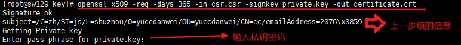

## 一、查看openssl版本

```shell
openssl version
```

## 二、创建文件夹存放秘钥、证书、csr文件

```shell
cd /root
mkdir key
```

## 三、生成秘钥

生成一个 2048 位的 RSA 私钥:

```shell
openssl genpkey -algorithm RSA -out private.key -aes256
```

回车后:会提示输入密码

注:
**private.key名称可替换**

### 命令解析：

```text
openssl
OpenSSL 是一个开源的工具包，用于实现 SSL/TLS 协议以及加密算法。它广泛用于生成密钥、证书、加密数据等操作。

genpkey
这是 OpenSSL 的一个子命令，用于生成私钥（Private Key）。genpkey 是一个通用的私钥生成命令，支持多种加密算法（如 RSA、ECDSA 等）。

-algorithm RSA
指定生成的密钥类型为 RSA（Rivest-Shamir-Adleman）。RSA 是一种非对称加密算法，广泛用于加密通信和数字签名。它基于大整数分解的数学难题，具有较高的安全性。

-out private.key
指定生成的私钥文件保存路径和文件名。这里将私钥保存为 private.key 文件。私钥文件是极其重要的，它用于解密数据或生成数字签名，必须妥善保管，避免泄露。

-aes256
这个选项表示对生成的私钥文件进行加密保护，加密算法使用 AES-256。AES-256 是一种对称加密算法，具有较高的安全性。通过加密私钥文件，可以防止私钥被未经授权的人员直接读取。

当运行这条命令时，OpenSSL 会提示用户输入一个密码（passphrase）。这个密码将用于加密私钥文件。只有输入正确的密码，才能解密并使用私钥。
```

## 四、生成证书签名请求（csr）

```shell
openssl req -new -key private.key -out csr.csr

```

回车后:
系统会提示需要输入私钥的密码，还有提示输入国家、省份、城市、组织等信息

注:  
private.key为上一步的.key文件  
**csr.csr名称可替换**

### 命令解析：

```text
openssl req
openssl req 是 OpenSSL 的一个子命令，用于生成和处理证书签名请求（CSR）。CSR 是一个文件，其中包含公钥、身份信息（如域名、组织信息等）以及签名信息，用于向证书颁发机构（CA）申请数字证书。

-new
这个选项表示生成一个新的 CSR。它会启动一个交互式流程，提示用户输入证书相关的身份信息。

-key private.key
指定用于生成 CSR 的私钥文件路径。私钥文件 private.key 中包含公钥部分，CSR 中的公钥就是从这个私钥文件中提取的。私钥用于对 CSR 中的内容进行签名，确保 CSR 的完整性和真实性。

-out csr.csr
指定生成的 CSR 文件的保存路径和文件名。CSR 文件将包含公钥和身份信息，并且通过私钥签名。生成的 csr.csr 文件可以提交给证书颁发机构（CA）进行签名，生成最终的数字证书。

执行过程

当运行这条命令时，OpenSSL 会提示用户输入证书相关的身份信息，包括以下内容：

Country Name ©：国家代码，如 CN（中国）、US（美国）。
State or Province Name (ST)：省份或州。
Locality Name (L)：城市或地区。
Organization Name (O)：组织名称。
Organizational Unit Name (OU)：组织单位名称（如部门名称）。
Common Name (CN)：通用名称，通常是域名（如 www.example.com），对于服务器证书，CN 应该是服务器的域名。
Email Address：联系邮箱地址。
Challenge Password：挑战密码（可选，用于某些特定用途）。
Optional Company Name：可选的公司名称。
这些信息将被包含在 CSR 中，并通过私钥进行签名。生成的 CSR 文件是一个文本文件，通常以 -----BEGIN CERTIFICATE REQUEST----- 和 -----END CERTIFICATE REQUEST----- 作为开头和结尾。

```

## 五、 生成自签证书

```shell
openssl x509 -req -days 365 -in csr.csr -signkey private.key -out certificate.crt

```



### 命令解析：

```text
openssl x509
openssl x509 是 OpenSSL 的一个子命令，用于处理 X.509 证书。它可以用于查看证书内容、验证证书、生成自签名证书等操作。

-req
这个选项表示处理一个证书签名请求（CSR）。它告诉 OpenSSL，输入文件是一个 CSR，而不是其他类型的文件（如证书或私钥）。

-days 365
指定生成的证书的有效期为 365 天。数字证书都有一个有效期，超过有效期后，证书将不再被信任。你可以根据需要调整这个值，例如 -days 730 表示有效期为两年。

-in csr.csr
指定输入的 CSR 文件路径。这个 CSR 文件通常是由前面的 openssl req 命令生成的，包含了公钥和身份信息。

-signkey private.key
指定用于签名的私钥文件路径。这个私钥文件必须与生成 CSR 时使用的私钥相同。自签名证书的签名过程是使用私钥对证书内容进行签名，以证明证书的完整性和真实性。

-out certificate.crt
指定生成的证书文件的保存路径和文件名。生成的证书文件 certificate.crt 是一个 X.509 格式的证书，可以用于 SSL/TLS 服务器或其他需要证书的场景。

```

## 六、移除私钥的密码

不移除的话会出现每次都要输入密码

```shell
openssl rsa -in private.key -out private.key

```

## 七、配置nginx

[centos-nginx.md](centos-nginx.md)

## 八、浏览器信任证书（以Chrome为例）

```text
1、将 certificate.crt 导出到本地。

2、系统设置 → 证书 → 导入并信任。
```

# 九、结语

最终会生成三个文件：


