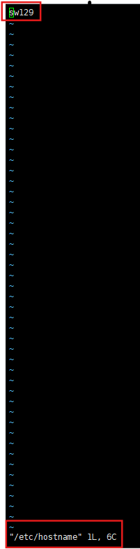

## 一、centos安装配置

1、下载centos7得iso（DVD是没有桌面得版本）  
2、vmware安装  
3、运行**dhclient**自动获取ip  
4、vmware想要后台运行虚拟机设置: 虚拟机终端中打开虚拟网络编辑器中设置VMnet8, 并关闭"使用本地DHCP服务将IP地址分配给虚拟机"
这个选项

## 二、设置固定IP

`网卡配置`:

1、进入/etc/sysconfig/network-scripts  
2、寻找ifcfg-开头的文件，如centos7版本 默认网卡名称就是ifcfg-ens33，而centos6.5版本，默认网卡名称为ifcfg-eth0  
**（注：ifcfg-lo是环回接口（loopback）。virbr是虚拟网桥（Virtual
Bridge），virbr0是虚拟网桥网卡。一般centos6.5版本前普遍默认的网卡是eth0，centos7版本后普遍默认的网卡是ensxx（xx为数字）。当然也有已经修改过的网卡名称。环回接口的作用是作为本地软件环回测试本主机的进程之间的通信之用，简单理解，就是用做本机测试的，而且它的inet，也就是ip，只能是127.0.0.1 ）
**  
3、vim ifcfg-ens33

4、添加内容

```vim
IPADDR="192.168.88.88"#这就是你想要固定的IP地址
NETMASK="255.255.255.0"#这是子网掩码
GATEAWAY="192.168.88.2"#这是网关，和第三步里面的配置一样
DNS1="192.168.88.2#设置为和网关一致就Ok了(DNS后面是数字1，不是字母l）
```

5、重启网卡  
systemctl restart network.service

## 设置主机名



```shell
1、vim /etc/hostname #修改为你要取的服务器名称
2、systemctl restart systemd-hostnamed #重启
3、hostname #查看
```

## 三、日常学习

3.1

```text
/etc/profile
是用来配置全局环境变量,以及加载一些默认脚本的配置文件，它会在登录时初始化这个文件  
~/ .bashrc
是当前用户级别的配置文件,仅影响当前用户和交互式 shell 的环境设置。
```

3.2

```text
echo
主要用来输入、输出内容,可搭配其他管道使用
例子：
1、echo "hello" 控制台返回hello
2、echo "hello" > a.txt 将hello输入到a.txt文件中
```

3.3

```text
source 
用于重新加载配置文件
例子：source /etc/profile
```

3.4

```text
ln
将一个目录或文件链接到另一目录或文件中
```
